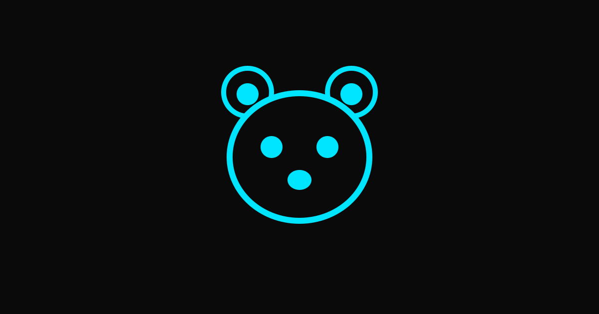

<p align="center">
  
</p>

# Kuma Agent

**Kuma Agent is a privacy-first AI agent runtime forked from [Hermes Agent](https://github.com/NousResearch/hermes-agent) by [Nous Research](https://nousresearch.com).**

Kuma inherits the full Hermes feature set — terminal UI, multi-platform messaging gateway (Telegram, Discord, Slack, WhatsApp, Signal), agent-curated memory with self-improving skills, scheduled automations, subagent spawning, and 40+ built-in tools. Over time it will diverge with skill packs, hybrid local/cloud LLM routing, and a Planner → Coder → Reviewer multi-agent pipeline.

> **Day-1 status.** This is the initial surface rebrand. The CLI command, Python module names, and documentation URLs still use `hermes`. Identity, attribution, and licensing reflect the fork. Code-level rebranding lands in subsequent releases — see [ATTRIBUTION.md](ATTRIBUTION.md) for what we inherit and what's planned.

---

## Quick install

```bash
curl -fsSL https://raw.githubusercontent.com/zerosecai/hermes-agent/main/scripts/install.sh | bash
```

Linux, macOS, WSL2, Termux. Native Windows is not supported — use [WSL2](https://learn.microsoft.com/en-us/windows/wsl/install).

After installation:

```bash
source ~/.bashrc    # or: source ~/.zshrc
hermes              # start chatting
```

The `kuma` command will be introduced in a later release with `hermes` kept as an alias.

---

## Documentation

Until Kuma has its own docs site, the upstream Hermes documentation is authoritative — the runtime is the same:

**[hermes-agent.nousresearch.com/docs](https://hermes-agent.nousresearch.com/docs/)**

| Section | What's covered |
|---------|---------------|
| [Quickstart](https://hermes-agent.nousresearch.com/docs/getting-started/quickstart) | Install → setup → first conversation |
| [CLI usage](https://hermes-agent.nousresearch.com/docs/user-guide/cli) | Commands, keybindings, sessions |
| [Configuration](https://hermes-agent.nousresearch.com/docs/user-guide/configuration) | Config file, providers, models |
| [Messaging gateway](https://hermes-agent.nousresearch.com/docs/user-guide/messaging) | Telegram, Discord, Slack, WhatsApp, Signal |
| [Skills system](https://hermes-agent.nousresearch.com/docs/user-guide/features/skills) | Procedural memory, Skills Hub |
| [Memory](https://hermes-agent.nousresearch.com/docs/user-guide/features/memory) | Persistent memory, user profiles |
| [MCP integration](https://hermes-agent.nousresearch.com/docs/user-guide/features/mcp) | Connect any MCP server |
| [Architecture](https://hermes-agent.nousresearch.com/docs/developer-guide/architecture) | Project structure, agent loop |
| [Environment variables](https://hermes-agent.nousresearch.com/docs/reference/environment-variables) | Full env var reference |

---

## What Kuma adds

Planned divergence from upstream — *not yet shipped*:

- **Skill packs** — chunk-based, auto-indexed packs (~1GB each). Initial pack: `kuma-pack-tsreact` (TypeScript + React + Vite).
- **Hybrid LLM routing** — local-first with cloud burst (Ollama Cloud, Local Ollama, LM Studio).
- **Multi-agent pipeline** — Planner → Coder → Reviewer, scalable to 10 parallel coders.
- **Privacy-first defaults** — telemetry off by default, transparent.
- **Brand** — Kuma cyber-bear, Cyan/Black palette.

Where these make sense upstream, contributions flow back to Hermes.

---

## Attribution & license

- **Upstream:** [NousResearch/hermes-agent](https://github.com/NousResearch/hermes-agent) (MIT, ~8.7k stars)
- **Authors:** Nous Research and 142+ contributors
- **Kuma additions:** © 2026 [ZeroSec AI](https://zerosec-ai.com), MIT

See [ATTRIBUTION.md](ATTRIBUTION.md) for full credit and [LICENSE](LICENSE) for terms.

---

## Contributing

The contributor workflow is upstream Hermes's — see [CONTRIBUTING.md](CONTRIBUTING.md). Issues specific to Kuma additions land here; agent-runtime work generally belongs upstream first.

Quick start:

```bash
git clone https://github.com/zerosecai/hermes-agent.git kuma-agent
cd kuma-agent
./setup-hermes.sh     # installs uv, creates venv, installs .[all], symlinks ~/.local/bin/hermes
./hermes              # auto-detects the venv
```

---

## Community

- 🐛 [Issues](https://github.com/zerosecai/hermes-agent/issues) — Kuma-specific
- 💬 [Upstream Discord](https://discord.gg/NousResearch) — runtime questions
- 📚 [Skills Hub](https://agentskills.io) — shared skill standard
